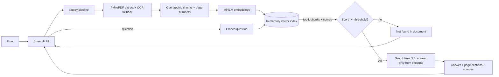

# ASTRA INTEL - Defence Document Intelligence (RAG)

**Challenge:** 01 - ASTRA INTEL · **Author:** <your name>

## Project overview
Upload a PDF, get a short summary, and ask questions. Answers are generated **only** from the document and show the page and passage they came from. If the document doesn't contain the answer, the system says so instead of guessing.

## Features
- PDF upload, per-page text extraction (PyMuPDF), OCR fallback for scanned pages
- Summary of the document
- Grounded Q&A with page-level citations and visible source passages
- "Not found in document" detection (similarity threshold + LLM check) with a supported/unsupported badge
- Multi-turn conversation with visible history
- Error states: corrupt/empty PDF, missing API key, no document uploaded
- Small retrieval evaluation script (`eval.py`)

## Tech stack
Python · Streamlit · PyMuPDF · sentence-transformers (`all-MiniLM-L6-v2`, local) · NumPy cosine search · Groq API (Llama 3.3 70B, free tier) · pytesseract (optional)

## Architecture

**Data flow:** PDF -> pages -> ~180-word overlapping chunks (each tagged with its page) -> normalized embeddings held in memory -> question embedded -> cosine similarity picks top 4 chunks -> if the best score is below `MIN_SCORE` we refuse, otherwise the LLM answers from those chunks only (temperature 0 for consistency) -> UI shows answer, page, and passages.

**Why these choices:** local embeddings = no cost and no data leaves the machine for retrieval; in-memory NumPy is enough for one document (a vector DB adds complexity with no benefit at this size); temperature 0 + retrieval gives repeatable answers.

## Setup
```bash
git clone <your-repo-url> && cd astra-intel
python -m venv venv && source venv/bin/activate      # Windows: venv\Scripts\activate
pip install -r requirements.txt
cp .env.example .env                                  # then put your free Groq key in .env
streamlit run app.py
```
Env vars: `GROQ_API_KEY` (required), `LLM_MODEL`, `MIN_SCORE` (optional).
Optional OCR: install the Tesseract binary (https://github.com/tesseract-ocr/tesseract).

## AI/ML
- Embeddings: `all-MiniLM-L6-v2` (small, fast on CPU, good semantic search quality for its size)
- LLM: Llama 3.3 70B via Groq, prompted to answer only from excerpts and output `NOT_FOUND` otherwise
- Pipeline: RAG (extract -> chunk -> embed -> retrieve -> grounded generation)

## Testing
- `python eval.py sample.pdf eval_questions.json` -> top-1 / top-k page accuracy. **Results: <fill in>**
- Example in/out: <paste a real question + answer + page>
- Out-of-document question (e.g. "Who won the 2018 World Cup?") -> "not found"
- Known failure cases: <fill in from your testing>

## Limitations
- One document at a time, in memory only (lost on refresh)
- Tables and multi-column layouts can extract badly
- Threshold (`MIN_SCORE`) is tuned by hand on a few PDFs
- OCR quality depends on scan quality

## Future improvements
Multi-document search, persistent vector store, reranking, text highlighting in the PDF viewer, document comparison.

## AI Usage Disclosure
**AI Tools Used:**
- Claude
- <add any others you really used>

**Used For:**
- Initial project scaffold and code suggestions
- Debugging
- <add: understanding APIs, docs, etc.>

**Major AI-Assisted Components:**
- Initial versions of rag.py and app.py
- <fill in>

**Personally Implemented / Modified / Tested:**
- <e.g. tuned chunk size and MIN_SCORE, wrote eval questions, fixed X>

**Validation:**
- <e.g. ran eval.py, tested corrupt PDF, tested out-of-document questions>

## Attribution
sentence-transformers, PyMuPDF, Streamlit, Groq API, Meta Llama 3.3.
