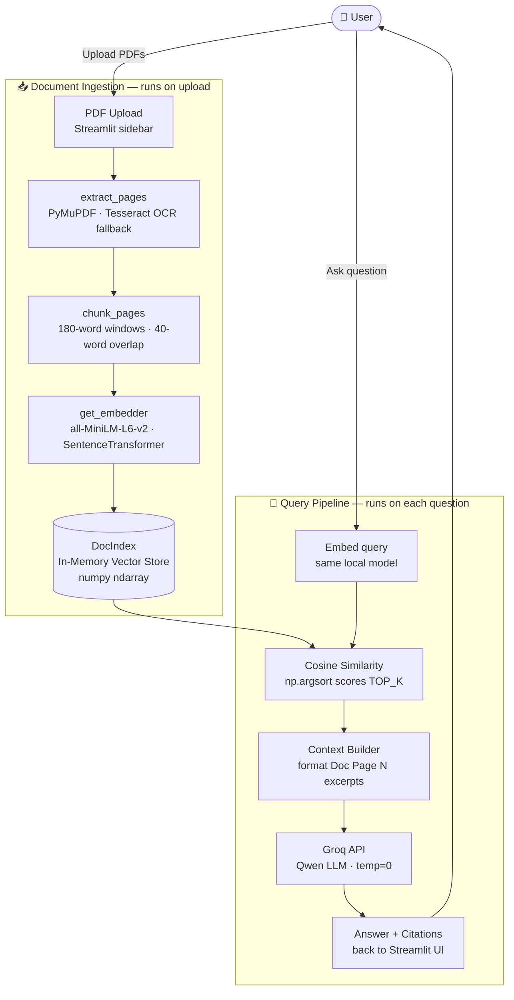

#  ASTRA INTEL

> **Armed Squad for Tactical Readiness & Awareness**
> Defence document intelligence — answers grounded strictly in your document.

[](https://python.org)
[](https://streamlit.io)
[](https://sbert.net)
[](https://groq.com)

---

## 📌 Project Overview

**Project name:** ASTRA INTEL — Armed Squad for Tactical Readiness & Awareness

**Selected challenge:** Defence / Intelligence document analysis — enabling users to interrogate large, sensitive PDF documents (military briefs, operational manuals, reports) and get answers that are 100% grounded in the source material.

**Problem being solved:**
Large defence and intelligence documents can run to hundreds of pages. Analysts waste hours searching manually, and generic AI chatbots hallucinate answers that are not in the document. ASTRA INTEL solves this by:
1. Embedding the document locally (no content leaves the machine during indexing)
2. Retrieving only the most semantically relevant passages for each question
3. Forcing the LLM to answer *only* from those passages — or honestly say it cannot find the answer

Every response includes the exact page number and passage used, making answers fully auditable and traceable.

---

## ✨ Features

### Core Features
| Feature | Details |
|---|---|
| **Grounded Q&A** | LLM answers using only retrieved document excerpts; returns an explicit "not found" message when the document has no relevant content |
| **Page-Level Citations** | Every answer cites the exact page number and passage it was drawn from |
| **100% Local Embeddings** | Chunks are embedded with `all-MiniLM-L6-v2` on-device — document content never leaves the machine during indexing |
| **PDF Text Extraction** | Reads native-text PDFs via PyMuPDF |
| **Multi-Turn Chat** | Conversation history maintained; last 3 turns are sent to the LLM for coherent follow-up answers |

### Additional Features
| Feature | Details |
|---|---|
| **OCR Fallback** | Scanned/image-only PDFs are processed via Tesseract OCR automatically (200 DPI) |
| **Multi-Document Upload** | Upload and index multiple PDFs simultaneously; answers cite which document they came from |
| **Auto-Summarisation** | 5–7 sentence document overview generated immediately on upload |
| **Smart Question Chips** | LLM-generated starter questions shown after upload to help users explore the document |
| **Retrieval Evaluator** | CLI script (`tests/eval.py`) to benchmark Top-1 and Top-K retrieval accuracy on labelled data |
| **Local LLM support** | Switch to Ollama or any OpenAI-compatible endpoint via `.env` with no code changes |

---

## 🛠️ Tech Stack

| Layer | Technology |
|---|---|
| **Language** | Python 3.10+ |
| **Web framework** | [Streamlit](https://streamlit.io/) 1.38+ |
| **PDF parsing** | [PyMuPDF (fitz)](https://pymupdf.readthedocs.io/) |
| **OCR** | [Tesseract](https://github.com/tesseract-ocr/tesseract) via [pytesseract](https://pypi.org/project/pytesseract/) *(optional)* |
| **Embedding model** | [`all-MiniLM-L6-v2`](https://huggingface.co/sentence-transformers/all-MiniLM-L6-v2) via [SentenceTransformers](https://sbert.net/) — runs locally |
| **Vector store** | In-memory NumPy ndarray (no external database) |
| **LLM** | [Qwen](https://huggingface.co/Qwen) open-source model served via [Groq API](https://groq.com/) |
| **LLM client** | [openai-python](https://github.com/openai/openai-python) SDK (OpenAI-compatible) |
| **Numerical compute** | [NumPy](https://numpy.org/) |
| **Env config** | [python-dotenv](https://pypi.org/project/python-dotenv/) |
| **Fonts** | [Space Grotesk](https://fonts.google.com/specimen/Space+Grotesk) + [Inter](https://fonts.google.com/specimen/Inter) via Google Fonts |
| **No external database** | All state is held in-process (`st.session_state` + NumPy arrays) |

---

## 🏗️ Architecture

### High-Level Data Flow



### Component Explanation

| Component | File | Responsibility |
|---|---|---|
| **Streamlit UI** | `src/app.py` | Page layout, CSS theming, session state, file upload, chat rendering |
| **RAG Engine** | `src/rag.py` | Extraction, chunking, embedding, vector search, LLM calls |
| **Retrieval Evaluator** | `tests/eval.py` | Offline Top-1/Top-K accuracy benchmarking |

### Data Flow (step by step)

1. User uploads PDF(s) → Streamlit reads bytes into memory
2. `extract_pages()` parses text page-by-page; OCR triggered if `< 20` chars on a page
3. `chunk_pages()` splits text into overlapping 180-word windows tagged with page number
4. `get_embedder()` encodes all chunks → normalised 384-dim vectors stored in `DocIndex.emb`
5. `summarize()` samples 12 evenly-spaced chunks and sends them to the LLM for an overview
6. `suggest_questions()` samples 10 chunks and asks the LLM to generate 4 starter questions
7. User types a question → query is embedded with the same local model
8. Cosine similarity computed as `DocIndex.emb @ q_vec` → top-4 chunks retrieved
9. If best score `< MIN_SCORE (0.10)` → query rejected without an LLM call
10. Retrieved excerpts are formatted as `[Doc, Page N] …` and injected into the LLM system prompt
11. LLM responds; `<think>` reasoning tags stripped; answer + citations rendered in chat

### Project Structure

```text
astra_intel/
├── src/
│   ├── app.py          ← Streamlit UI (session state, CSS, chat loop)
│   └── rag.py          ← RAG engine (extraction → chunking → embedding → LLM)
├── tests/
│   ├── eval.py                      ← Top-1 / Top-K retrieval benchmarker
│   ├── eval_questions.example.json  ← Sample evaluation dataset format
│   └── example-questions.md         ← Human-readable question writing guide
├── assets/                          ← Logo and brand assets
├── .streamlit/config.toml           ← Streamlit theme + port config
├── .env.example                     ← Environment variable template (copy to .env)
├── requirements.txt
└── AI_USAGE.md                      ← Full AI tools disclosure
```

---

## 🚀 Setup

### Prerequisites
- Python 3.10+
- [Tesseract OCR](https://github.com/tesseract-ocr/tesseract) *(optional — only needed for scanned PDFs)*
- A free [Groq API key](https://console.groq.com/keys)

### 1 — Clone & create virtual environment

```bash
git clone https://github.com/varshi495/astra_intel.git
cd astra_intel

python -m venv .venv

# Windows
.venv\Scripts\activate
# macOS / Linux
source .venv/bin/activate
```

### 2 — Install dependencies

```bash
pip install -r requirements.txt
```

### 3 — Configure environment variables

```bash
# Windows
copy .env.example .env
# macOS / Linux
cp .env.example .env
```

Then open `.env` and set your values:

```env
GROQ_API_KEY=your_groq_api_key_here   # required

# Optional — defaults shown
LLM_MODEL=qwen/qwen3-8b
LLM_BASE_URL=https://api.groq.com/openai/v1
MIN_SCORE=0.10
```

| Variable | Default | Description |
|---|---|---|
| `GROQ_API_KEY` | *(required)* | Groq cloud API key |
| `LLM_MODEL` | `qwen/qwen3-8b` | Model identifier passed to the API |
| `LLM_BASE_URL` | Groq endpoint | Swap to `http://localhost:11434/v1` for Ollama |
| `MIN_SCORE` | `0.10` | Cosine similarity floor — queries below this score are rejected |

### 4 — Run the application

```bash
streamlit run src/app.py
```

Open `http://localhost:8502` in your browser.

### 5 — Run retrieval evaluation (optional)

```bash
python tests/eval.py path/to/document.pdf tests/eval_questions.example.json
```

---

## 🤖 AI / ML

### Models Used

| Model | Where | Why chosen |
|---|---|---|
| `all-MiniLM-L6-v2` | Embedding (local, CPU) | Lightweight (80 MB), fast, strong semantic accuracy on sentence-level tasks. Runs fully offline — no document content ever leaves the machine. 384-dim vectors are compact enough for in-memory cosine search without an external DB. |
| Qwen (via Groq API) | Answer synthesis, summarisation, question suggestion | Open-source model with strong instruction-following. Groq's LPU inference makes responses near-instant. Qwen3's `<think>` chain-of-thought mode is explicitly stripped so only the final answer is shown to the user. `temperature=0` enforces deterministic, factual output. |

### Why RAG instead of a fine-tuned model?

- Documents are **user-supplied at runtime** — a general fine-tuned model cannot know their contents
- RAG requires **no training cost** and generalises to any PDF
- Grounding constraints + `NOT_FOUND` rejection make hallucination measurable and preventable
- Every answer is **auditable**: the exact passage and page number are always shown

### AI Pipeline

```
PDF bytes
  → extract_pages()        [PyMuPDF + Tesseract OCR]
  → chunk_pages()          [180-word overlapping windows]
  → SentenceTransformer    [local, normalised 384-dim embeddings]
  → DocIndex (numpy)       [in-memory cosine similarity store]

User question
  → SentenceTransformer    [same model, same embedding space]
  → DocIndex.search()      [matrix dot product → top-4 chunks]
  → MIN_SCORE gate         [reject if best score < 0.10]
  → Groq API (Qwen)        [strict grounding prompt → answer]
  → UI                     [answer + page citations + similarity scores]
```

### AI Tools Used in Development

See [`AI_USAGE.md`](AI_USAGE.md) for the complete disclosure. Summary:
- **Antigravity IDE (Claude Sonnet)** was used as the primary coding assistant for architecture design, code generation, debugging, and writing this documentation
- All AI-generated code was reviewed, tested, and understood before being committed

---

## 🧪 Testing

### How It Was Tested

| Method | Description |
|---|---|
| **Manual end-to-end** | Uploaded real PDFs via the Streamlit UI; verified answers, citations, and "not found" rejections against known document contents |
| **Retrieval evaluator** | `tests/eval.py` benchmarks Top-1 and Top-K page retrieval accuracy against a labelled question-and-page dataset |
| **Edge case probing** | Tested with: corrupt PDFs, image-only (scanned) PDFs, empty documents, missing API key, off-topic questions |

### Running the Evaluator

```bash
python tests/eval.py path/to/document.pdf tests/eval_questions.example.json
```

Create your own question set in this format:
```json
[
  { "q": "What is the maximum operational range?", "page": 12 },
  { "q": "Who signed the protocol amendment?",     "page": 47 }
]
```

### Example Inputs & Outputs

**Input:** Upload `field_manual.pdf`, ask *"What is the recommended patrol interval?"*

**Output (supported answer):**
```
The recommended patrol interval is every 4 hours during high-alert status,
reduced to 2 hours when threat level exceeds Amber. (field_manual.pdf, p. 34)

✅ Supported by document
📍 Sources: PAGE 34 · "...patrol intervals shall not exceed 4 hours..."
            Similarity: 0.741
```

**Input:** Ask *"What is the capital of France?"*

**Output (not found):**
```
I couldn't find this in the uploaded document.

⚠️ Not supported by document · top similarity: 0.031 (threshold 0.10)
```

### Known Failure Cases

| Failure | Condition | Notes |
|---|---|---|
| Poor retrieval on very short documents | Fewer chunks than `TOP_K (4)` | Retrieval still works but k is reduced automatically |
| OCR quality degradation | Handwritten text, low-DPI scans, non-Latin scripts | Tesseract accuracy drops; text may be garbled |
| Answer splits across chunk boundary | Key sentence straddles two chunks | 40-word overlap mitigates this but does not eliminate it |
| Slow first load | Embedding model downloaded on first run (~80 MB) | Subsequent runs use the cached model |
| Context window overflow | Very long answers with many citations | Capped at 500 tokens; truncation may cut off long answers |

---

## ⚠️ Limitations

- **In-memory only** — the vector index is not persisted between sessions. Re-uploading the same document re-processes it from scratch.
- **Single-machine** — no multi-user support; one `DocIndex` object per Streamlit session.
- **English-optimised** — `all-MiniLM-L6-v2` performs best on English text; retrieval quality degrades on other languages.
- **Flat chunking** — the chunker uses word-count windows and does not understand document structure (headings, tables, lists). Structured content may be chunked sub-optimally.
- **No table/figure extraction** — PyMuPDF extracts text flows; tabular data and figures are not semantically parsed.
- **Cloud LLM dependency** — answer generation requires an active Groq API key and internet connection (unless a local LLM is configured via `LLM_BASE_URL`).
- **MIN_SCORE is a blunt instrument** — the 0.10 cosine threshold is a global setting; some document types may need tuning.
- **No authentication** — the app is intended for single-user local use and has no login, access control, or audit logging.

---

## 🔭 Future Improvements

| Improvement | Value |
|---|---|
| **Persistent index (FAISS / ChromaDB)** | Avoid re-processing the same document on every session restart |
| **Structured chunking** | Parse headings, bullet lists, and tables as distinct semantic units for better retrieval precision |
| **Table & figure extraction** | Use PyMuPDF's table API or a vision model to capture non-text content |
| **Re-ranking** | Add a cross-encoder re-ranking step after initial retrieval to improve precision on ambiguous queries |
| **Hybrid search** | Combine dense vector search with BM25 keyword search (reciprocal rank fusion) for better recall on exact-match queries |
| **Multi-language support** | Switch to a multilingual embedding model (e.g. `paraphrase-multilingual-MiniLM-L12-v2`) |
| **Streaming responses** | Stream LLM tokens to the UI for faster perceived response time |
| **Document comparison mode** | Answer questions that span multiple uploaded documents with cross-document citations |
| **User authentication & audit log** | Essential for real defence deployments; log every query and the source passages used |
| **Automated eval dataset generation** | Use an LLM to auto-generate question-page pairs from a document for instant benchmarking |

---

## 🙏 Attribution & Acknowledgements

| Component | Library / Service |
|---|---|
| Web framework | [Streamlit](https://streamlit.io/) |
| PDF parsing | [PyMuPDF (fitz)](https://pymupdf.readthedocs.io/) |
| OCR (optional) | [Tesseract](https://github.com/tesseract-ocr/tesseract) via [pytesseract](https://pypi.org/project/pytesseract/) |
| Local embeddings | [`all-MiniLM-L6-v2`](https://huggingface.co/sentence-transformers/all-MiniLM-L6-v2) via [SentenceTransformers](https://sbert.net/) |
| LLM inference | [Qwen](https://huggingface.co/Qwen) open-source model via [Groq API](https://groq.com/) |
| Vector maths | [NumPy](https://numpy.org/) |
| LLM client | [openai-python](https://github.com/openai/openai-python) |
| Fonts | [Space Grotesk](https://fonts.google.com/specimen/Space+Grotesk) · [Inter](https://fonts.google.com/specimen/Inter) via Google Fonts |

All core application logic (`src/app.py`, `src/rag.py`, `tests/eval.py`) is original work.

> **Security note:** No `.env` files or API keys are committed to this repository. See `.gitignore`.

---

*See [`AI_USAGE.md`](AI_USAGE.md) for the full AI tools disclosure.*
